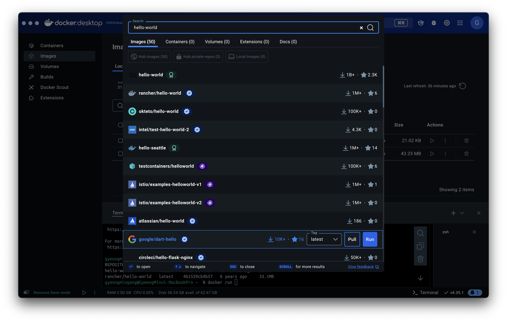
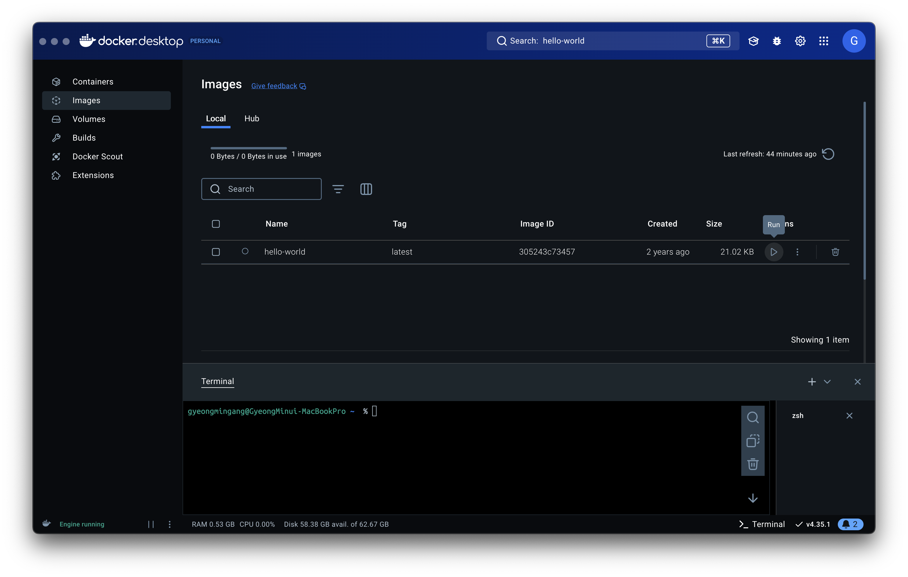
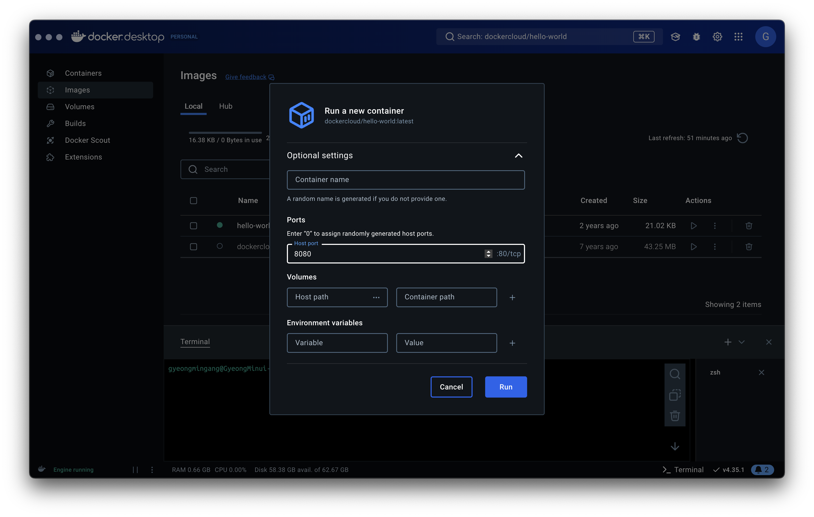
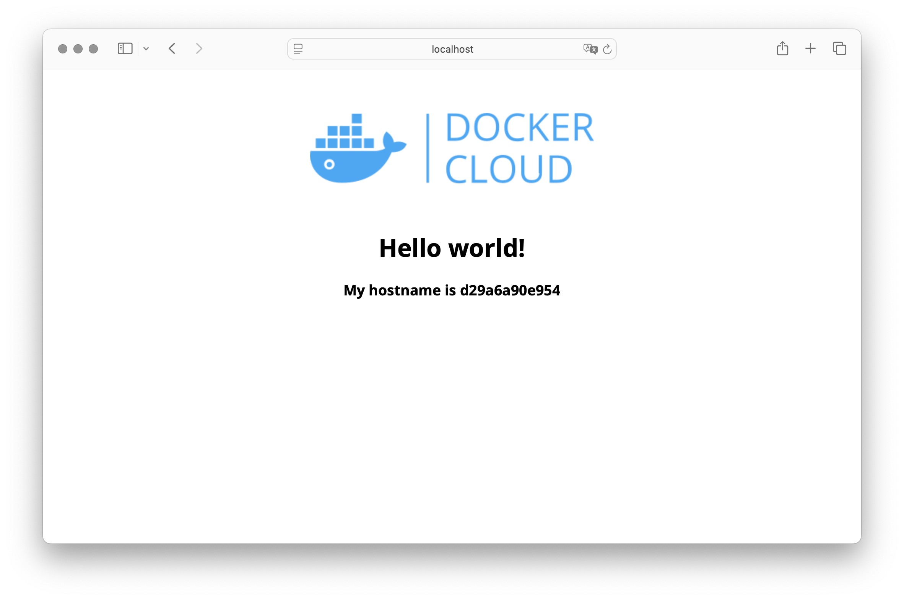

## GUI를 이용한 Docker 사용
> Docker Desktop 설치, 설치시 자동으로 Docker Engine, Docker CLI, Docker Compose와 같이 필요한 프로그램들도 설치됨

  - Docker Desktop 설치
  - Docker Desktop 실행

## Homebrew를 이용한 Docker 설치
  - brew install --cask docker (Docker Desktop 설치)

  - brew install docker (Docker CLI 설치)
  - brew install docker-compose (Docker Compose 설치,보통 Docker CLI에 포함된 최신Compose 버전이 설치됨)
  - brew install docker-machine (Docker Machine 설치,로컬이 아닌 클라우드 환경에서 Docker 컨테이너를 관리하는 데 사용됨)

## CLI의 도커 기본 명령어
  - docker images ls : 도커 이미지 목록 조회
  - docker ps : 도커 컨테이너 목록 조회
  - docker run : 도커 컨테이너 실행
  - docker stop : 도커 컨테이너 중지
  - docker rm : 도커 컨테이너 삭제
  - docker rmi : 도커 이미지 삭제

## Docker 이미지 실행
  
  1.배포되어 있는 이미지중 hello-world 이미지를 검색
  

  2-1.container 에서 재생 버튼 클릭
  

  or 

  2-2.CLI 명령어 입력
  
  ```zsh
  docker image ls
  # 이미지 목록 조회
  docker run hello-world:latest
  # 이미지 실행
  ```
  

같은 방식으로 다른 이미지들도 실행할 수 있음

- dockercloude/hello-world 이미지 실행
  - GUI를 이용해서 포트 포워딩 설정
  

  - CLI 명령어 입력
  ```zsh
  docker run -p 8080:80 dockercloud/hello-world
  ```
  - 정상적으로 실행되면 브라우저에서 확인 가능 (http://localhost:8080로 접속시)
  
  
  - 종료
  ```zsh
  docker ps
  # 컨테이너 목록 조회
  docker stop <container_id>
  # 컨테이너 중지
  ```