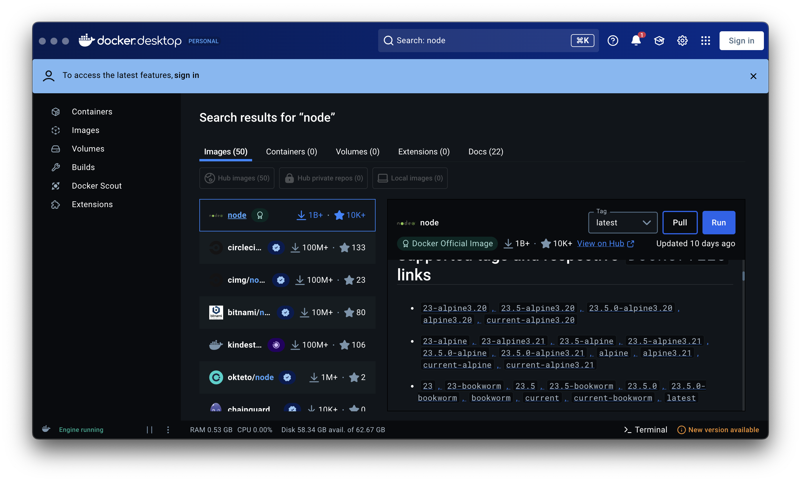
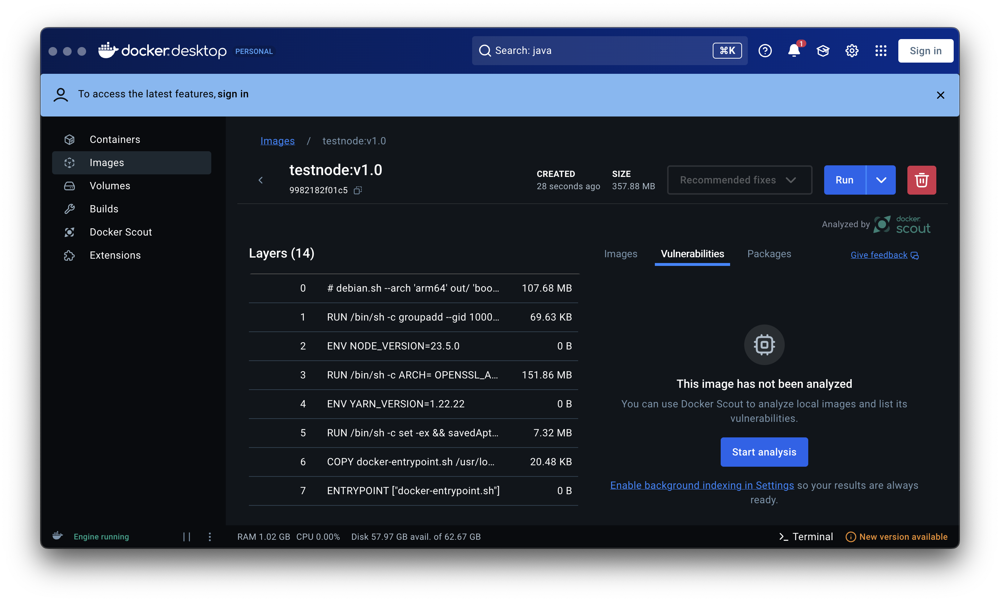
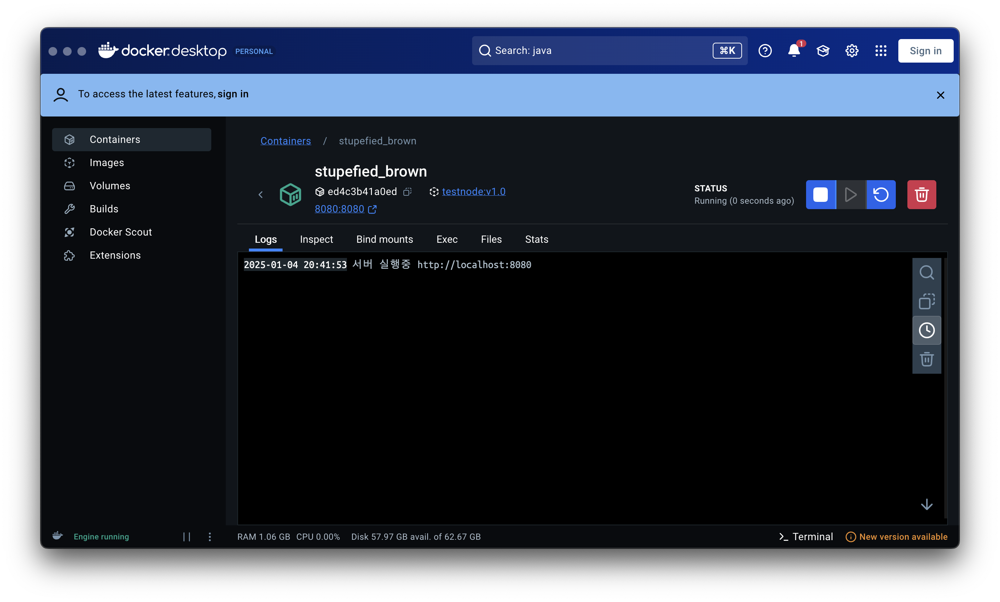

## Dockerfile로 이미지 빌드

1. Q. 내가 만든 프로그램을 이미지로 만들고싶으면?
  1. Dockerfile 생성
  2. Dockerfile에 이미지에 넣을 내용 작성
  3. docker build

2. Dockerfile 작성
- 이미지에 넣을 내용 채우기
  - 어떤 OS를 사용할 것인지
  - 어떤 프로그램을 사용할 것인지
  - 어떤 터미널명령어를 사용할 것인지
  - 어떤 파일을 집어넣을 것인지
  - ...
- 이미지 빌드 명령어 입력
- 이미지 실행 명령어 입력


1. 처음에 OS이미지는 도커허브에서 찾아서 사용


2. Dockerfile 작성
```dockerfile
# 보통 OS정도 넣어줌
# 지금은 node, linux 이미지를 사용
FROM node:23.5-slim

# 작업 디렉토리 설정
WORKDIR /app

# . 은 현재 디렉토리를 의미 COPY로 복사
COPY . .

# package.json 파일에 있는 모든 모듈 설치
# 1. RUN npm install
# 2. RUN ["npm", "install"] 권장
RUN ["npm", "install"]

# 포트 노출 (안써도 됨)
EXPOSE 8080

# 컨테이너 실행시 실행할 명령어
CMD ["node", "server.js"]
```
이렇게 작성후 
```shell
docker build -t 이미지이름:태그(버전) .
```

이렇게 입력하면 이미지가 빌드됨

Docker Desktop에서 이미지 확인 가능


3. 이미지 실행
```shell
docker run -d -p 8080:8080 이미지이름:태그(버전)
```
